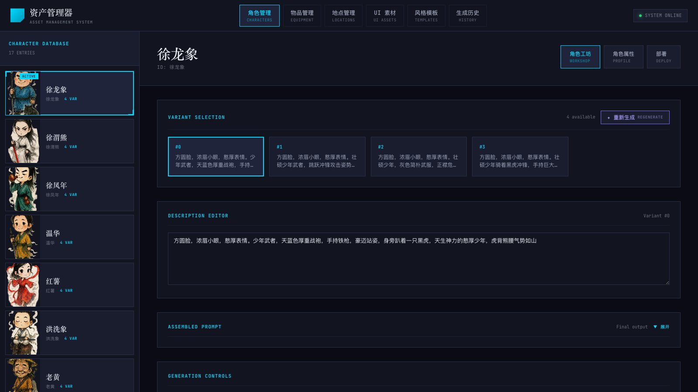
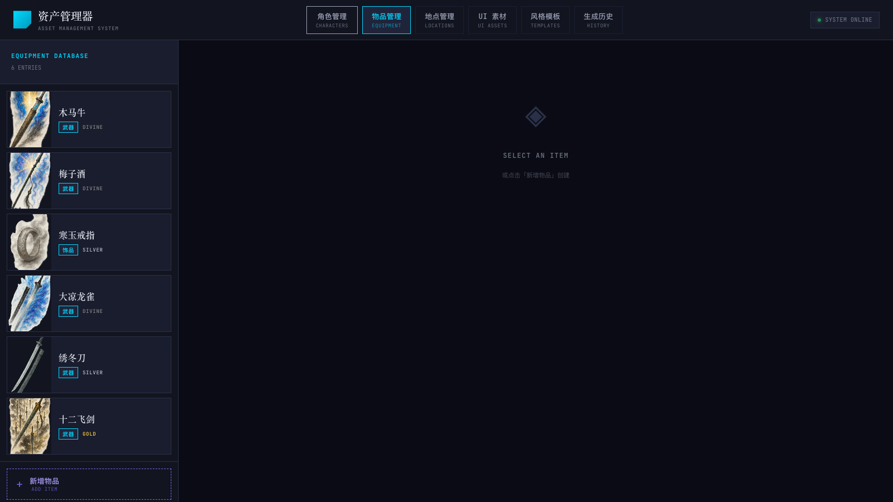
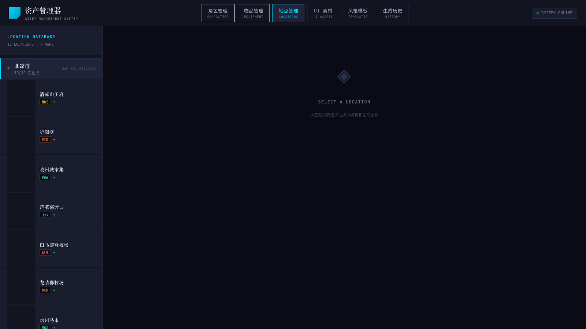
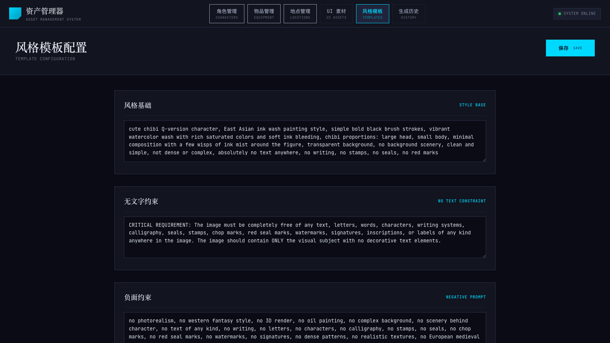
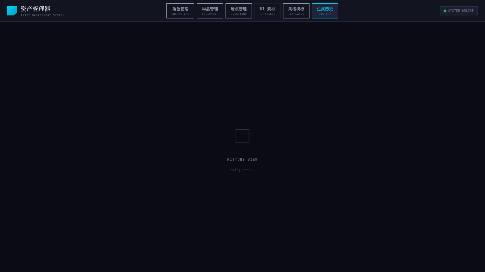

# Sutan 素材管理系统审视报告

> 审视日期：2026-04-07  
> 审视范围：后端 `main.py`（4195行）、前端 `src/`（18个文件）、数据层（workspace + runtime）、部署流程、UI 截图  
> 在线验证地址：http://localhost:8101

---

## 目录

1. [现状概览](#1-现状概览)
2. [代码架构审视](#2-代码架构审视)
3. [功能完整性审视](#3-功能完整性审视)
4. [用户体验审视](#4-用户体验审视)
5. [数据一致性审视](#5-数据一致性审视)
6. [性能与可靠性审视](#6-性能与可靠性审视)
7. [问题汇总与优先级](#7-问题汇总与优先级)
8. [改进建议（按优先级）](#8-改进建议按优先级)
9. [关键界面截图](#9-关键界面截图)

---

## 1. 现状概览

| 维度 | 数据 |
|------|------|
| 后端文件 | `tools/asset-manager/backend/main.py`，4195 行，单文件 |
| API 端点 | 56 个（GET/POST/PUT/DELETE） |
| 前端组件 | 18 个文件（App.tsx + 16 个组件 + api.ts + types.ts） |
| Tabs | 6 个（角色 / 物品 / 地点 / UI素材 / 风格模板 / 生成历史） |
| 当前数据量 | 角色 17，物品 6，地点 10，UI素材 4，特殊卡 8 |
| 工作区数据 | `scripts/data/cards/*.json` + `scripts/data/maps/*.json` |
| 运行时数据 | `src/renderer/data/configs/` |

### 整体评分

| 维度 | 评分 | 说明 |
|------|------|------|
| 代码架构 | ⭐⭐☆☆☆ | 单文件 4000+ 行，大量重复代码 |
| 功能完整性 | ⭐⭐⭐☆☆ | 核心流程完整，但有 1 个 Tab 空壳，缺少删除功能 |
| 用户体验 | ⭐⭐⭐☆☆ | 视觉风格统一，但有较多空白状态未处理 |
| 数据一致性 | ⭐⭐⭐☆☆ | workspace↔runtime 同步机制有效，但有路径不一致问题 |
| 性能可靠性 | ⭐⭐☆☆☆ | 无缓存、无锁、无超时控制 |

---

## 2. 代码架构审视

### 2.1 后端代码组织

**现状：**  
`main.py` 是 4195 行的单文件，包含 56 个 API 端点、60 个 helper 函数、4 套完整的领域逻辑（角色/物品/地点/UI素材）和数十个领域常量。

**具体问题：**

#### 🔴 P1 — 4个 SSE event_stream 几乎完全相同（代码重复严重）

四个生成端点（`/api/generate`、`/api/item-generate`、`/api/scene-generate`、`/api/ui-generate`）各自独立实现了 SSE 流式事件，约 60 行代码每套均重复：

```python
# 这个模式在 main.py 重复了 4 次：
async def event_stream():
    ...
    for i in range(1, count + 1):
        progress_event = json.dumps({...})
        yield f"data: {progress_event}\n\n"
        try:
            saved_path = await loop.run_in_executor(None, _generate_*_blocking, ...)
        except Exception as exc:
            error_event = json.dumps({...})
            yield f"data: {error_event}\n\n"
    done_event = json.dumps({"type": "done", ...})
    yield f"data: {done_event}\n\n"
```

**改进建议：** 提取 `_stream_generation(client, tasks, folder)` 通用函数。

#### 🔴 P1 — 领域逻辑没有模块化

文件中的逻辑分为 4 个大段（用注释分隔），但都在同一文件中。任何人修改一处都可能影响其他领域。领域常量（路径、样板 prompt、Pydantic 模型）也都混在一起：

```
main.py
├── 角色 API（418~1251行）
├── 物品 API（1252~2457行）   
├── 地点 API（2458~3740行）   
└── UI素材 API（3740~4195行）
```

**改进建议：** 拆分为 `routers/characters.py`、`routers/items.py`、`routers/scenes.py`、`routers/ui_assets.py` + `core/storage.py`（读写 JSON）+ `core/generation.py`（SSE 流）。

#### 🟡 P2 — 硬编码路径字符串

场景部署中有两处硬编码的地图子目录名：

```python
# line 3212
game_public_dir = GAME_PUBLIC_MAPS_DIR / "beiliang"  # 图标
# line 3179  
game_public_dir = GAME_PUBLIC_MAPS_DIR / "map_001"   # 背景
```

这两个值不一致（图标用`beiliang`，背景用`map_001`），且扩展到多地图时必须手动修改代码。

#### 🟡 P2 — `batch_config.json` 职责重叠

`scripts/batch_config.json`（68条记录，按 variant 扁平化存储）与 `scripts/data/cards/characters.json`（18条，按角色聚合存储）存在职责重叠。角色 API 从 `batch_config.json` 读取 variant 信息，角色 profile 从 `characters.json` 读取，两套数据源的同步没有明确机制。

### 2.2 前端代码组织

**现状：**  
前端总体结构清晰，18 个文件组织合理。主要问题：

#### 🟡 P2 — App.tsx 中所有 Tab 状态集中管理

所有 Tab 的状态（characters、items、scenesData、uiAssets 等）全部在 `App.tsx` 中管理，组件间通过 props 传递。当前 6 个 Tab 尚可接受，但继续扩展会导致 App.tsx 过重。

#### 🟡 P2 — API 模块中 SSE 流读取逻辑重复 3 次

`api.ts` 中 `generate`、`generateItemImages`、`generateUIAssetImages` 三个函数包含几乎相同的 SSE 读取循环（约 30 行 × 3）。

---

## 3. 功能完整性审视

### 3.1 各 Tab 功能状态

| Tab | 状态 | 核心能力 | 缺失功能 |
|-----|------|---------|---------|
| 角色管理 | ✅ 完整 | 创建/编辑/生成立绘/选择/部署 | 删除/归档，搜索 |
| 物品管理 | ✅ 基本完整 | 创建/编辑/生成图片/选择/部署 | 删除，搜索，初始自动选中 |
| 地点管理 | ✅ 基本完整 | 编辑/生成图标+背景/选择/部署 | 多地图支持，删除位置需API |
| UI 素材 | ✅ 基本完整 | 创建/编辑/生成/选择/部署 | 删除，批量操作 |
| 风格模板 | ✅ 完整 | 编辑提示词模板/保存 | 无 |
| **生成历史** | 🔴 **空壳** | — | **完全未实现（Coming soon...）** |

#### 🔴 P0 — 生成历史 Tab 是空页面

后端已有 `/api/history` 端点，`history.json` 文件存储最近 50 条生成记录，前端 `api.ts` 也有 `getHistory()` 函数。但 `App.tsx` 中 history Tab 仅显示 "Coming soon..."，完全没有实现。

#### 🟠 P1 — 角色/物品没有删除功能

- 后端仅有 `DELETE /api/scenes/{scene_id}` 一个删除端点
- 角色和物品没有对应的删除 API
- 目前只能手动编辑 JSON 文件删除，非常危险
- 存在一个 `轩辕青锋测试` draft 角色（status=draft，无 image），无法通过 UI 清理

#### 🟠 P1 — 地点管理：显示"7 MAPS"但实际只有 1 个有数据

侧边栏标题显示 "10 LOCATIONS · 7 MAPS"，但实际 `maps.json` 中只有一个地图 `map_001_beiliang`（北凉道），其余 6 个地图是空的。这是代码层面写死 7 的问题。

#### 🟡 P2 — 缺少搜索/筛选功能

角色列表 17 个、物品 6 个当前都没有搜索框或筛选功能。随内容增长（预计 50+ 角色），列表将难以浏览。

#### 🟡 P2 — 没有批量操作

无法批量生成（如"给所有未生成立绘的角色批量生成"）或批量部署。

### 3.2 部署流程评估

部署流程（workspace → runtime）的设计是合理的：

```
[生成图片] → [选择候选图] → [部署]
     ↓               ↓           ↓
 samples/     meta.selected_asset   runtime JSON + public dir
```

**优点：**
- 工作区（scripts/data/）与运行时（src/renderer/data/configs/）分离清晰
- 部署时自动过滤 draft 记录
- deploy 前有 preview 端点

**问题：**

#### 🟠 P1 — 场景图标和背景的部署路径不一致

```python
# 图标（icon）部署到：
GAME_PUBLIC_MAPS_DIR / "beiliang" / f"{scene_id}.png"
# 背景（backdrop）部署到：
GAME_PUBLIC_MAPS_DIR / "map_001" / f"{scene_id}_backdrop.png"
```

图标用 `beiliang`（地图名），背景用 `map_001`（地图ID），这两个值不同且均硬编码，扩展到多地图时必然出 bug。

#### 🟡 P2 — 部署没有回滚机制

一旦 deploy，原有游戏图片被 `shutil.copy2` 覆盖，没有备份/回滚。

---

## 4. 用户体验审视

### 4.1 角色管理 Tab

**现状截图：**



**优点：**
- 左侧角色列表清晰，显示当前立绘缩略图
- 右侧三 Tab 布局（工坊/属性/部署）逻辑清晰
- VARIANT SELECTION 卡片切换直观

**问题：**

#### 🟡 P2 — Variant 描述编辑区缺少自动保存状态提示

描述编辑后没有明显的"已保存/未保存"状态指示。

#### 🟡 P2 — 没有角色搜索框

17 个角色已经需要滚动，增加到 30+ 时体验会变差。

### 4.2 物品管理 Tab

**现状截图：**



**问题：**

#### 🟠 P1 — 物品管理初始进入默认为空白右侧

角色管理进入时自动选中第一个角色，但物品管理进入右侧显示 "SELECT AN ITEM"，行为不一致。

#### 🟡 P2 — 稀有度标签颜色与实际稀有度不匹配

物品列表中"木马牛"显示为"武器 DIVINE"，"梅子酒"显示"武器 DIVINE"——从游戏设计角度，木马牛（北凉军事器械）标为 DIVINE 似乎偏高，可能是数据输入问题，但系统没有任何验证或提示。

### 4.3 地点管理 Tab

**现状截图：**



**问题：**

#### 🟠 P1 — 地点列表图标缩略图全部空白

10 个地点的左侧缩略图区域均为空（深色方块），即使某些地点已有 `icon_image` 数据，可能是 URL 路径渲染问题。

#### 🟠 P1 — 显示"7 MAPS"与实际不符

侧边栏标题显示"10 LOCATIONS · 7 MAPS"，实际只有 1 个有内容的地图。

### 4.4 UI 素材 Tab

**现状：** 4 个素材，功能基本可用。

#### 🟡 P2 — category 只显示 ID 不显示中文名

素材 category 值如 `background`、`frame` 等直接显示英文，缺少中文标签映射。

### 4.5 风格模板 Tab

**现状截图：**



**整体评价：** 功能完整，无大问题。

#### 🟡 P2 — 模板无版本管理

修改后无法查看历史版本，也没有"重置为默认值"按钮。

### 4.6 生成历史 Tab

**现状截图：**



#### 🔴 P0 — 完全未实现

界面仅显示 "HISTORY VIEW · Coming soon..."，后端已有数据但前端完全没接入。

---

## 5. 数据一致性审视

### 5.1 Workspace → Runtime 同步机制

```
scripts/data/cards/characters.json  →  src/renderer/data/configs/cards/characters.json
scripts/data/cards/equipment.json   →  src/renderer/data/configs/cards/equipment.json
scripts/data/cards/special.json     →  src/renderer/data/configs/cards/special.json
scripts/data/maps/locations.json    →  src/renderer/data/configs/maps/locations.json
scripts/data/maps/maps.json         →  src/renderer/data/configs/maps/maps.json
scripts/data/ui/ui_assets.json      →  （UI素材 deploy 只写文件，不更新 runtime JSON）
```

**当前一致性验证（2026-04-07）：**

| 数据集 | Workspace 数量 | Runtime 数量 | 一致 |
|-------|--------------|-------------|------|
| 角色卡 | 18（含1个draft）| 17 | ✅ |
| 装备卡 | 6 | 6 | ✅ |
| 特殊卡 | 8 | 8 | ✅ |
| 地点 | 10 | 10 | ✅ |

### 5.2 资产文件存储路径不一致

**现状：** 各类型素材的公共目录指向不同的根目录：

| 资产类型 | 公共目录（asset-manager serve） | 游戏运行时路径 |
|---------|-------------------------------|-------------|
| 角色立绘 | `root/public/portraits/` | `root/public/portraits/` ✅ |
| 物品图片 | `root/public/items/` | `root/public/items/` ✅ |
| UI素材 | `root/public/ui-assets/` | `root/public/ui-assets/` ✅ |
| **地图图标** | `src/renderer/public/maps/` | `src/renderer/public/maps/` ✅ |

> **注意：** 地图图片存储在 `src/renderer/public/maps/` 而非 `root/public/maps/`，与其他资产的约定不同。这是历史设计决定，需要记录。

#### 🟠 P1 — 地图背景部署子目录写死为"map_001"

```python
# tools/asset-manager/backend/main.py:3179
game_public_dir = GAME_PUBLIC_MAPS_DIR / "map_001"
```

当未来新增第二张地图时，所有新地图的背景都会被部署到 `map_001/` 目录，覆盖或混淆数据。

### 5.3 位置数据分散在两个文件

**现状：**  
`locations.json` 存储地点的静态信息（名称、类型、prompt 等），地点的 `position`（地图上坐标 x/y）存储在 `maps.json` 的 `location_refs` 数组里。这种分割增加了读取/写入逻辑的复杂度（`_read_location_profiles` 和 `_write_location_profiles` 各约 70 行），且容易产生两者不同步的风险。

### 5.4 workspace locations 缺少 publish_status

**现状：** 所有 10 个地点的 `meta` 中没有 `publish_status` 字段（值为"N/A"）。`_deploy_map_to_runtime` 的过滤逻辑有后备：

```python
# 如果 publish_status 为空，也视为"已发布"
if publish_status in ("published", "ready") or not publish_status:
    runtime_locs.append(...)
```

这意味着所有未设置 status 的地点都会被发布，即使它们可能还是 draft。

### 5.5 UI素材缺少 runtime JSON 更新

**现状：** UI素材的 deploy 只做了文件复制（`selected_file → ui-assets/`），没有更新 runtime 的 `ui_assets.json`。`scripts/data/ui/ui_assets.json` 没有对应的 runtime 文件（`src/renderer/data/configs/ui/ui_assets.json` 存在但不在 deploy 流程中更新）。

---

## 6. 性能与可靠性审视

### 6.1 无内存缓存

**现状：** 每个 API 请求都直接读取 JSON 文件（`_read_workspace_characters`、`_read_item_profiles` 等），没有任何内存缓存。

**当前影响：** 测量 API 响应时间约 10-17ms，数据量小时无感知。  
**潜在风险：** 当素材数量达到 100+ 时，每次 list 请求读取大文件会有明显延迟。

### 6.2 无并发保护

**现状：** 没有文件锁或数据库事务。如果两个请求同时写入 `characters.json`，会产生竞争条件（race condition），可能导致数据丢失。

```python
# 典型的读-改-写模式，无保护：
records = _read_workspace_characters()   # 读
records[target_idx]["meta"]["publish_status"] = "published"  # 改
_write_workspace_characters(records)     # 写（可能覆盖其他请求的修改）
```

**当前风险：** 低（单用户使用），但一旦多人同时操作会出问题。

### 6.3 SSE 生成无超时

**现状：** OpenAI 图片生成请求在 `loop.run_in_executor` 中执行，没有设置超时。如果 API 挂起，前端会一直等待，没有任何 timeout 或取消机制。

### 6.4 API 错误处理基本完整

大多数端点有 try/except 和 HTTPException，基本符合要求。但有些 helper 函数的异常处理过于宽泛（如 `except Exception: pass`）。

---

## 7. 问题汇总与优先级

### P0（必须立即修复）

| # | 问题 | 影响 |
|---|------|------|
| P0-1 | 生成历史 Tab 完全未实现（只显示"Coming soon..."） | 功能缺失，数据已有但无法查看 |

### P1（应尽快修复）

| # | 问题 | 影响 |
|---|------|------|
| P1-1 | main.py 4195 行单文件，4 套领域逻辑混在一起 | 可维护性极差 |
| P1-2 | 4 个 SSE event_stream 约 200 行重复代码 | 修改一处需同步修改 4 处 |
| P1-3 | 角色/物品没有删除/归档功能 | 积累 draft 数据无法清理 |
| P1-4 | 场景 deploy 路径 hardcode（icon→beiliang，backdrop→map_001） | 多地图时必然出 bug |
| P1-5 | 物品管理初始进入右侧为空白（与角色管理行为不一致） | UX 不一致 |
| P1-6 | 地点列表图标缩略图全部空白 | 用户无法快速识别地点 |
| P1-7 | 地点 sidebar 显示"7 MAPS"但实际只有 1 个有数据 | 误导性信息 |

### P2（计划内改进）

| # | 问题 | 影响 |
|---|------|------|
| P2-1 | 无并发保护（读-改-写无锁） | 多用户场景数据丢失风险 |
| P2-2 | 无内存缓存，每次请求读文件 | 数据量增大后性能下降 |
| P2-3 | SSE 生成无超时机制 | API 挂起时前端永久等待 |
| P2-4 | batch_config.json 与 characters.json 两套数据源 | 职责不清，同步关系不明确 |
| P2-5 | 缺少搜索/筛选功能 | 内容增长后列表难以浏览 |
| P2-6 | 缺少批量操作（批量生成/部署） | 效率低下 |
| P2-7 | 位置数据分散在两个文件中 | 读写逻辑复杂，容易不同步 |
| P2-8 | workspace locations 无 publish_status | draft 地点可能意外发布 |
| P2-9 | UI素材 deploy 不更新 runtime JSON | runtime ui_assets.json 与 workspace 不同步 |
| P2-10 | 模板无版本管理/重置功能 | 误改后无法恢复 |
| P2-11 | 部署无回滚机制 | 部署错误图片后无法撤销 |
| P2-12 | api.ts SSE 读取循环重复 3 次 | 前端维护成本 |
| P2-13 | App.tsx 所有 Tab 状态集中管理 | 继续扩展时难以维护 |

---

## 8. 改进建议（按优先级）

### 🔴 P0 修复：实现生成历史 Tab

**具体方案：**  
后端 `/api/history` 已返回格式：`[{timestamp, name, asset_type, images:[{path, url}]}]`

在 `App.tsx` 的 history Tab 中接入：

```tsx
// App.tsx history tab
{activeTab === 'history' && (
  <HistoryTab />
)}
```

创建 `components/HistoryTab.tsx`，显示：
- 按日期分组的生成记录列表
- 每条记录显示：时间、素材名称、类型、缩略图网格
- 点击图片可放大查看（复用 `ImageModal.tsx`）

**工作量：** 约半天。

---

### 🟠 P1 修复：增加角色/物品删除功能

**具体方案：**

后端新增：
```python
@app.delete("/api/characters/{character_name}")
def delete_character(character_name: str) -> Dict[str, Any]:
    """将角色标记为 archived（软删除），不删除文件"""
    ...
```

前端在角色详情的三点菜单或 Deploy Tab 中加入"归档"按钮，归档后在列表中隐藏（或显示灰色 archived 状态）。

**工作量：** 约 1 天。

---

### 🟠 P1 修复：场景 deploy 路径动态化

**具体方案：**

```python
# 当前（硬编码）
game_public_dir = GAME_PUBLIC_MAPS_DIR / "beiliang"

# 改为（从 workspace 读取 map 的 public_subdir 字段）
map_public_subdir = ws_map.get("public_subdir", map_id)
game_public_dir = GAME_PUBLIC_MAPS_DIR / map_public_subdir
```

在 `maps.json` 中为每个 map 增加 `public_subdir` 字段（如 `"beiliang"`），统一控制部署目录。

**工作量：** 约 2 小时。

---

### 🟠 P1 修复：物品管理自动选中第一项

**具体方案：** 参照角色管理的 `loadData` 逻辑：

```typescript
// App.tsx
if (items.length > 0 && !selectedItem) {
  setSelectedItem(items[0]);
}
```

**工作量：** 5 分钟。

---

### 🟠 P1 修复：地点图标缩略图显示

**需要排查：** `LocationList.tsx` 中地点图标 `current_icon` 字段是否正确渲染为 `` 标签，以及 `/game-maps/...` 静态路由是否正确挂载。

---

### 🟠 P1 重构：main.py 拆分（建议按领域拆分）

**具体方案：**

```
tools/asset-manager/backend/
├── main.py              # FastAPI app 初始化、路由注册
├── core/
│   ├── storage.py       # JSON 文件读写（带锁）
│   ├── generation.py    # SSE 流式生成通用逻辑
│   └── config.py        # 所有路径常量
├── routers/
│   ├── characters.py    # 角色 API（约 800 行 → 独立文件）
│   ├── items.py         # 物品 API（约 1200 行）
│   ├── scenes.py        # 地点 API（约 1300 行）
│   └── ui_assets.py     # UI素材 API（约 500 行）
└── models/
    └── schemas.py       # 所有 Pydantic 模型
```

**工作量：** 约 2 天（纯重构，无功能变更）。

---

### 🟡 P2 改进：添加文件读写锁

```python
import threading
_json_lock = threading.Lock()

def _read_workspace_characters() -> List[Dict]:
    with _json_lock:
        ...

def _write_workspace_characters(records: List[Dict]) -> None:
    with _json_lock:
        ...
```

**工作量：** 约 2 小时。

---

### 🟡 P2 改进：SSE 生成超时

```python
saved_path = await asyncio.wait_for(
    loop.run_in_executor(None, _generate_single_blocking, ...),
    timeout=120  # 2分钟超时
)
```

**工作量：** 约 1 小时。

---

### 🟡 P2 改进：workspace locations 补充 publish_status

为所有 10 个现有地点手动或通过脚本设置 `meta.publish_status = "published"`，避免依赖后备逻辑。

**工作量：** 约 30 分钟（一次性操作）。

---

## 9. 关键界面截图

### 角色管理 Tab


### 物品管理 Tab


### 地点管理 Tab


### 风格模板 Tab


### 生成历史 Tab（空壳）


---

## 附录：API 端点清单

共 56 个端点，按领域分布：

| 领域 | 端点数 |
|------|--------|
| 角色（/api/characters*） | 16 |
| 物品（/api/items*） | 13 |
| 地点（/api/scenes*、/api/maps*） | 16 |
| UI素材（/api/ui-assets*） | 11 |
| 通用（/api/templates、/api/history、/api/health） | 3 |
| SSE 生成（/api/generate、/api/item-generate 等） | 4 |
| **合计** | **56** |

---

*报告生成：2026-04-07 | 审视人：AI Review*
