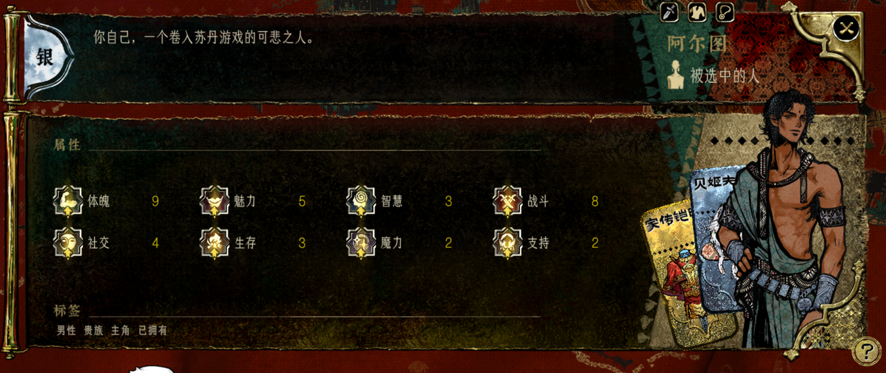
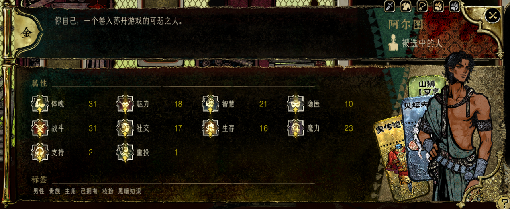
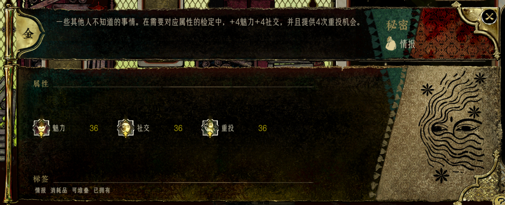
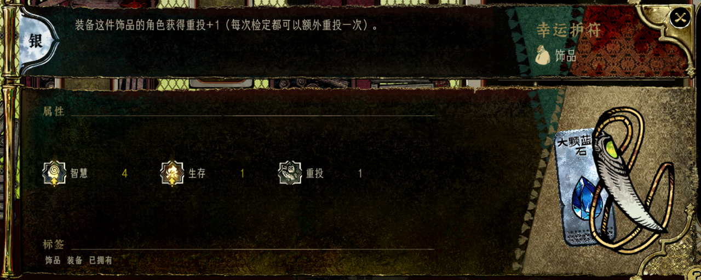
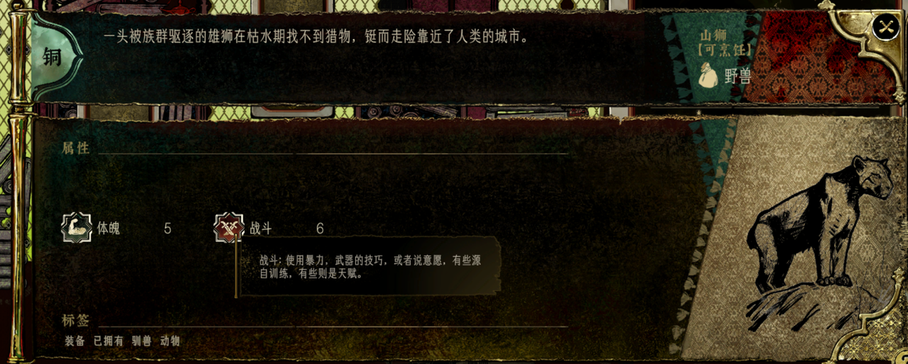
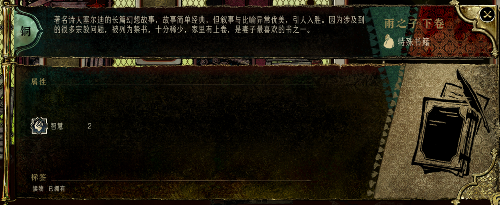
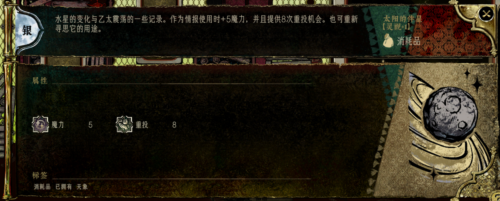
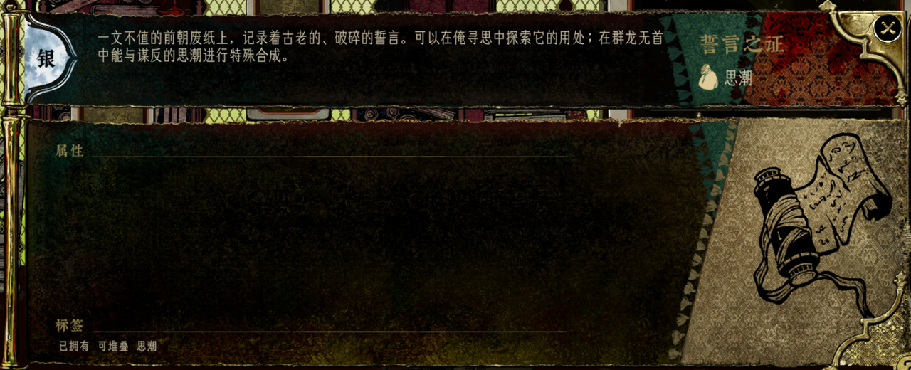
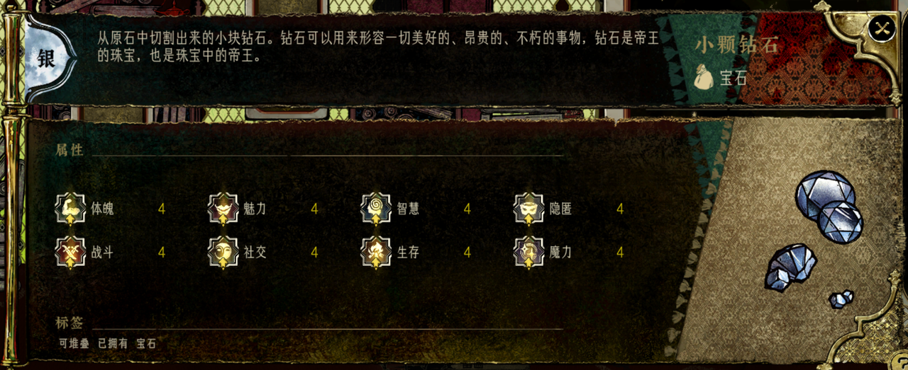

# 卡牌设计

本文档定义各类型卡牌的设计规则。枚举值参考 [../data/enums.md](../data/enums.md)，数据结构参考 [../data/schema.md](../data/schema.md)。

## 卡片通用设计

- **整体风格**：复古克苏鲁风格，深色调、斑驳纸张纹理、黄铜金属边框
- **布局结构**：
  - 左上角：稀有度标识徽章（金/银/铜/石）
  - 顶部：卡片描述文字
  - 中部：属性区域（图标+数值网格排列）
  - 底部：标签区（物品类别、状态标签）
  - 右侧：物品插图/角色立绘

---

## 人物卡

人物卡是游戏核心资源，可投入场景参与检定。

### 基本信息

1. **稀有度** - 金、银、铜、石（金色边框最高级，石色最低级）
2. **介绍** - 角色背景描述
3. **姓名 + 类别** - 如"阿尔图"、"山狮"
4. **装备槽** - 可扩展，仅人物卡有
5. **装备卡片区** - 所有装备的卡片都在这儿显示
6. **人物立绘** - 右侧展示角色形象

### 属性系统

**8项基础属性**：体魄、魅力、智慧、战斗、社交、生存、隐匿、魔力

**特殊属性**：
- 支持（support）：宫廷投票权重
- 重投（reroll）：额外重骰机会

### 标签系统

| 标签类型 | 示例 |
|----------|------|
| 身份标签 | 男性、女性、氏族、贵族 |
| 特性标签 | 弓箭、爱书人、黑曜知识 |
| 状态标签 | 已拥有、主角、妆扮 |

**标签玩法**：撕掉标签、增加标签、场景要求特定标签

### 示例图

---

## 情报卡

- **功能**：在需要对应属性的检定中提供加成
- **属性加成**：如+4魅力、+4社交
- **重投机会**：提供额外重投次数
- **标签**：情报、消耗品、可堆叠

### 示例图

---

## 装备卡

### 装备类型

| 类型 | 主要加成 | 特殊效果 |
|------|----------|----------|
| 武器 | combat | 可能附带技能 |
| 防具 | physique | 减伤效果 |
| 饰品 | 任意属性 | reroll+1等 |
| 坐骑 | survival/stealth | 移动加成 |

### 装备规则

1. **装备效果**：提供属性加成，如"重投+1（每次检定都可以额外重投一次）"
2. **宝石镶嵌**：装备可以镶嵌宝石增强效果
3. **标签**：装备、饰品、已拥有等

### 示例图

---

## 书籍卡

- **功能**：特殊书籍，提供智慧属性加成
- **标签**：携物、已拥有

### 示例图

---

## 消耗品卡

- **功能**：使用时提供临时属性加成和重投机会
- **类型**：天象类（如"太阳的伴星"）
- **效果**：如+5魔力，提供8次重投机会，可重复寻思

### 示例图

---

## 思潮卡

- **功能**：特殊合成材料
- **特点**：可在特定地点进行特殊合成
- **标签**：可堆叠、思潮

### 示例图

---

## 宝石卡

- **功能**：提供全属性加成
- **效果**：8项属性各+4
- **标签**：可堆叠、宝石
- **用途**：镶嵌到装备上

### 示例图

---

## 卡牌管理规则

### 手牌上限

- **上限数量**：512张
- **设计意图**：实际游戏中几乎不可能达到，作为技术安全边界
- **超限处理**：手牌达到上限时，无法获得新卡牌，奖励卡牌会被丢弃
- **解决方式**：玩家需主动丢弃或出售手牌后才能获得新卡牌

### 卡牌丢弃

- **丢弃入口**：卡牌管理界面
- **丢弃操作**：选中卡牌 → 点击丢弃按钮 → 确认
- **丢弃限制**：主角卡不可丢弃；已投入场景的卡牌不可丢弃
- **丢弃效果**：卡牌永久移除，无任何收益

### 卡牌出售

- **出售地点**：商店场景
- **出售价格**：见 [../data/balance.md](../data/balance.md)
- **出售限制**：主角卡、苏丹卡不可出售
