# UI布局

本文档定义游戏各界面的布局规范。

## 场景界面布局

### 整体结构

- **左侧区域**：场景背景画面、角色卡牌展示、交互卡槽
- **右侧对话框**：
  - 标题栏：金色装饰边框，显示场景名称
  - 内容区：事件描述文本
  - 选项区：多个可选择的分支选项
  - 底部操作栏：存档、关闭、确认、AUTO按钮
- **右侧功能栏**：帮助按钮、角色头像、资源计数

### 示例图

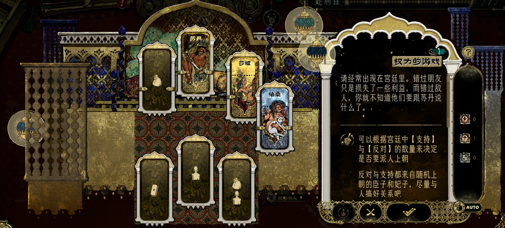
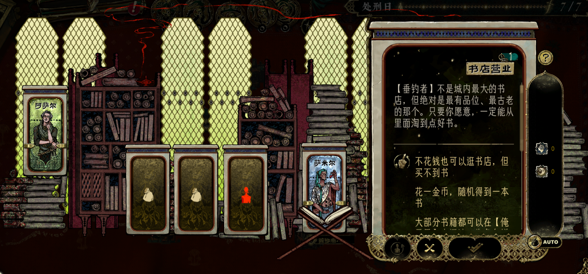
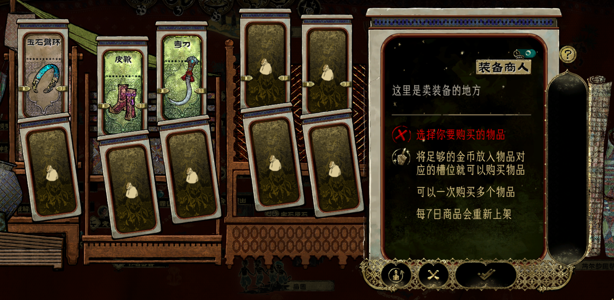

---

## 大地图界面

### 地图系统

1. **节点式地点标记**：金色圆形徽章形式呈现
2. **路径连接**：节点之间用虚线路径连接，构成游戏进度路线
3. **事件图标**：问号、感叹号、数字等表示任务或事件状态
4. **场景元素**：城市建筑剪影、商队、骆驼等装饰元素

### 场景标识

- 名字、图标、剩余时间
- 如果已经有人在场景中，显示其头像
- 有人时候的颜色和无人的颜色不同

### 底部卡牌队伍栏

- 左侧：卡牌槽位指示器（I、II、III、IV）
- 中间：12张角色卡牌横向展示
- 右侧：备用卡组区域
- 卡牌采用竖长型塔罗牌设计，不同背景色表示稀有度或类型

### 时间系统

- 右下角大型圆形金色罗盘/时钟
- 显示当前剩余天数（如"十一天"）
- 时间回溯功能：次数足够时可以返回上一天

### 示例图

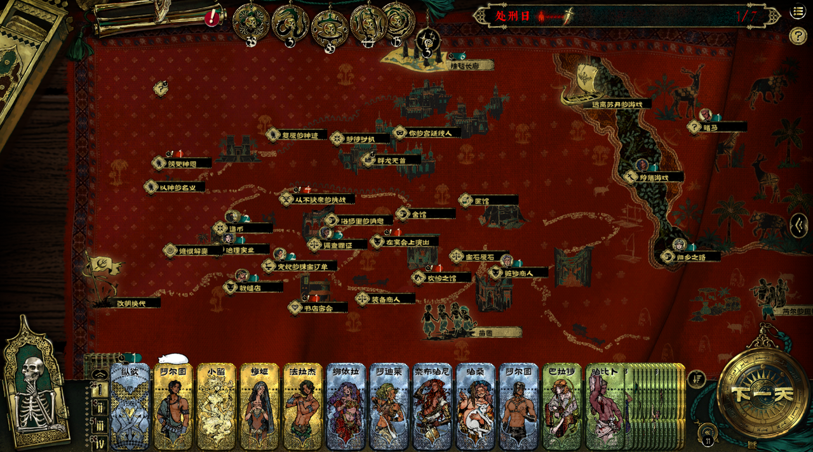

---

## 结算界面布局

### 整体结构

- **左右分屏设计**：左侧交互区（约40-45%）+ 右侧文本区（约55-60%）
- **视觉风格**：深色皮革背景、羊皮纸纹理、金色齿轮装饰、蒸汽朋克风格边框

### 右侧文本区

- **标题栏**：金色边框，显示场景名称
- **叙事文本**：大段羊皮纸背景的结算描述
- **选项区**：菱形符号（◆）标识的可选项（若有）
- **底部操作栏**：确认按钮、AUTO自动按钮
- **资源显示**：金币、护盾等当前资源

### 示例图

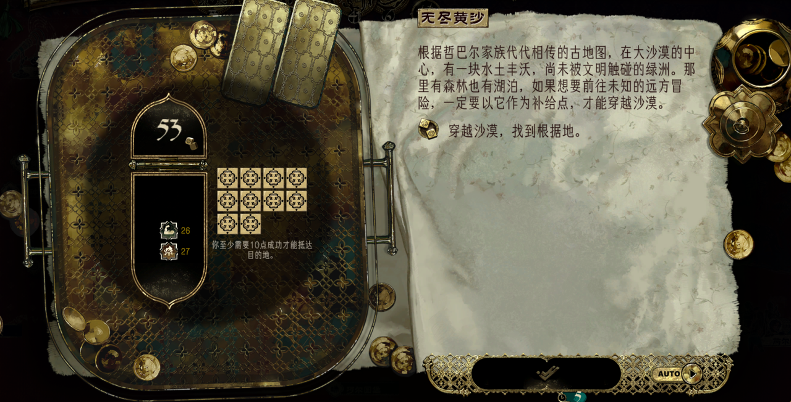

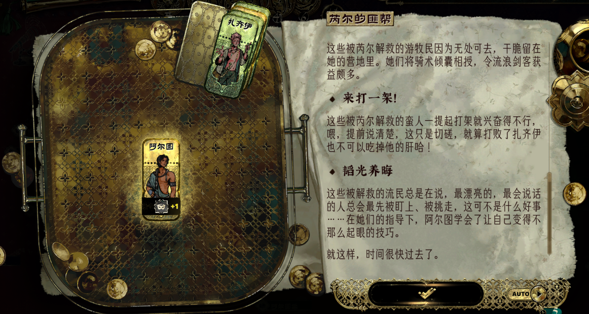
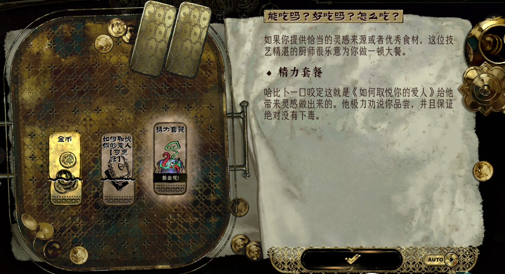

---

## 对话界面布局

### 整体结构

- **左右分栏**：左侧2/3文本和选项区域，右侧1/3角色立绘
- **装饰边框**：四角金色古典花纹装饰
- **确认按钮**：右下角黑色椭圆底+白色对勾图标

### 对话类型

#### 资源选择型

- 给出明确的属性增益数值
- 格式：物品名称 + 【属性1+数值 + 属性2+数值】
- 分级选择：如小颗（+1/+1）vs 大颗（+2/+1）
- 玩家需根据当前需求选择属性方向

#### 技能检定型

- 需要通过特定属性检定
- 格式：行动描述 + 【检定 + 属性名】
- 涉及属性：社交、体魄、隐匿、战斗、生存
- 可能有成功/失败两种结果

#### 纯叙述型

- 无需选择，推进剧情
- 长段对话 + 奖励说明
- 奖励提示：金色字体，显示"获得卡牌 XXX"
- 仅有"继续"按钮

### 交互特点

- **选项高亮**：鼠标悬停显示浅色半透明背景条
- **透明化数值**：直接显示属性加成，便于决策
- **检定提示**：明确告知需要的技能属性
- **即时反馈**：选择后显示获得的卡牌/资源

### 示例图

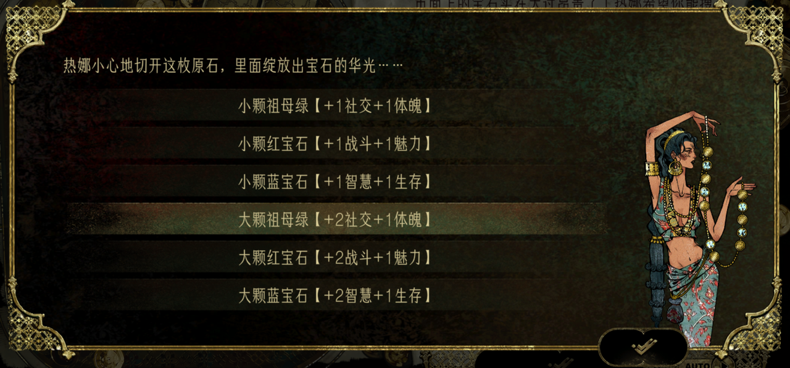
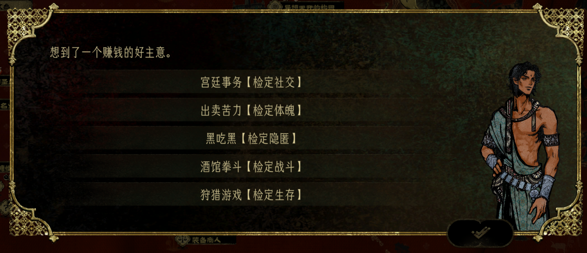
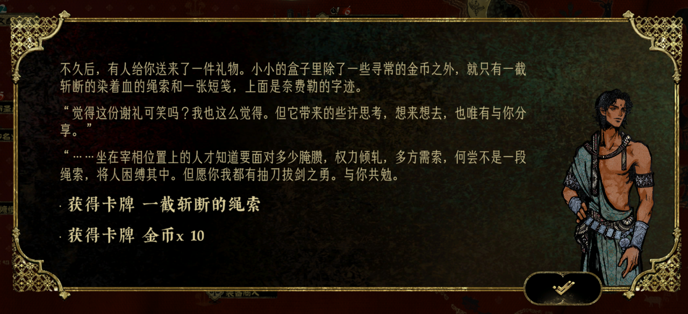

---

## 功能区界面

### 顶部状态栏

- **物品快捷栏**：卷轴、药水图标
- **声望系统**：5个圆形金色徽章，影响事件触发
- **角色状态图标**：当前角色信息

### 示例图

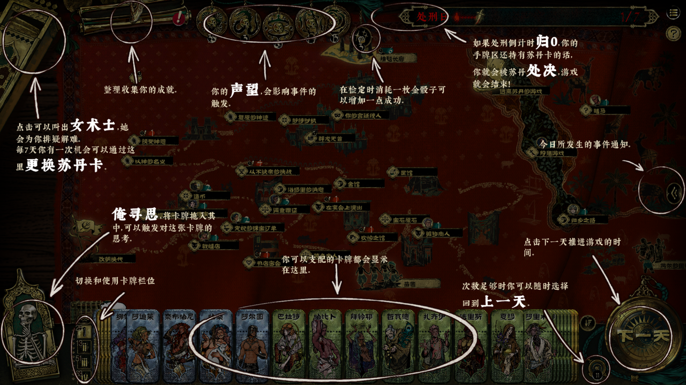

---

## 成就界面布局

### 整体结构

- **左侧区域**：成就列表导航
  - 顶部显示成就分类名称（如"一千零一夜"）和点数
  - 列表展示多个成就项，用金色分割线分隔
  - 已完成项显示金色勾选标记
- **右侧区域**：成就详情
  - 成就标题（暗红色横幅）
  - 成就图标（徽章样式，显示奖励数量如"+1"）
  - 成就描述和背景故事
  - 引用台词
  - 完成条件（带勾选标记）
  - 物品插图

### 示例图

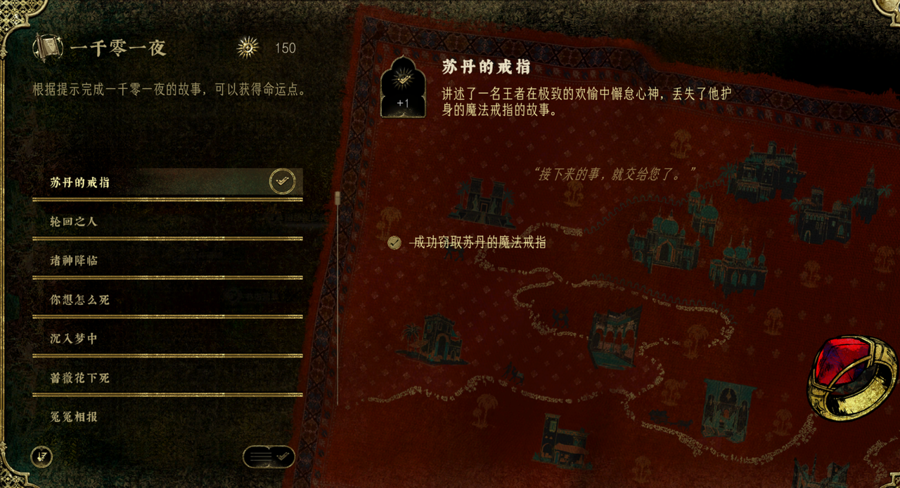
